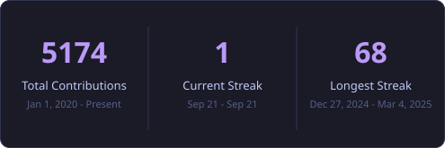
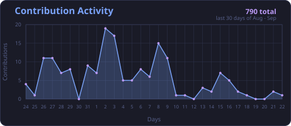

  
  
  
  
  
  
  

---

## 🚀 About Me

I'm a **Full-Stack Web & Mobile App Developer** based in Feni, Bangladesh, with hands-on experience across the entire workflow — frontend, backend, and database/DBMS design — end-to-end, from schema to pixel-perfect UI to native mobile builds. I ship across the **MERN / PERN / MEAN** stacks, **Next.js**, and **React Native / Flutter** for mobile, and I bring a debugging-first, performance-obsessed mindset to everything I build.

- 🔭 Currently building full-stack web & mobile products with **Next.js, React, React Native, Node.js, NestJS, Express, MongoDB, PostgreSQL & Supabase**
- 🌱 Actively deepening skills in **system design, cloud infrastructure, and testing**
- 🔍 Bring **SEO best practices** into every frontend project — performance, semantics, and discoverability aren't an afterthought
- 🤝 Open to full-stack web / mobile developer roles and freelance collaboration
- 📄 Full résumé: **[muhammad-jiku/muhammad-jiku](https://github.com/muhammad-jiku/muhammad-jiku)** → see `Muhammad Azizul Hoque Jiku.md` in this repo

 

## 🛠️ Skills & Tech Stack

<table>
<tr>
<td valign="top" width="50%">

**Frontend**

**Mobile**

**Database**

</td>
<td valign="top" width="50%">

**Backend**

**DevOps & Cloud**

**Testing & Tooling**

</td>
</tr>
</table>

 

## 📌 Featured Projects (résumé)

| Project | Highlights | Tech Stack |
|---|---|---|
| **Sports Mania** | Global, device-responsive sports store — category browsing, filters, pagination, search, and cart management | Material UI, Redux, MVC, MERN |
| **Dr. Abdul Kader's Personal Appointment App** | Device-responsive health platform — appointment scheduling and service-based booking | Tailwind CSS, MVC, MERN |
| **Conference Call App** | Device-responsive video conferencing — real-time chat, reactions, screen sharing, meeting recording | Next.js, React, Material UI, Tailwind CSS, JWT, VideoSDK API |

 

## 🔄 Latest Public Projects

_Automatically updated from my public GitHub activity — see [update-readme.yml](.github/workflows/update-readme.yml). Refreshes daily on a schedule, or instantly from any repo wired up with [templates/notify-profile.yml](templates/notify-profile.yml)._

<!-- PROJECTS-START -->
- **[jikmunn-blogs-discussions](https://github.com/muhammad-jiku/jikmunn-blogs-discussions)**  ·  updated 2026-09-01
- **[jikmunn-odyssey-task-one](https://github.com/muhammad-jiku/jikmunn-odyssey-task-one)**  ·  `TypeScript`  ·  updated 2026-05-03
- **[jikmunn-inventory-management](https://github.com/muhammad-jiku/jikmunn-inventory-management)**  ·  `TypeScript`  ·  updated 2026-03-03
- **[jikmunn-learning-management](https://github.com/muhammad-jiku/jikmunn-learning-management)** — Learn Now makes learning frictionless: students can sign in, search curated courses, purchase and enroll in minutes, while teachers create and manage courses — uploading videos, quizzes, and materials — all backed by a scalable serverless stack.  ·  `TypeScript`  ·  updated 2026-03-02
- **[jikmunn-real-estate-enterprise](https://github.com/muhammad-jiku/jikmunn-real-estate-enterprise)** — Rentiful is a real estate application built under the Jikmunn Real Estate Enterprise project. It is a digital platform where tenants can register, explore properties, and purchase their desired spaces. Managers are provided with tools to effectively administer and monitor lease agreements  ·  `TypeScript`  ·  updated 2026-02-28
- **[jikmunn-bike-inventory-client-side](https://github.com/muhammad-jiku/jikmunn-bike-inventory-client-side)** — Bike Decor Inventory is a modern MERN stack application for managing and showcasing bike accessories and inventory. It features secure authentication, user-specific inventory management, and a sleek, user-friendly interface for both admins and customers to explore and manage bike decor products.  ·  `JavaScript`  ·  updated 2026-01-19
<!-- PROJECTS-END -->

➡️ Browse everything: [github.com/muhammad-jiku?tab=repositories](https://github.com/muhammad-jiku?tab=repositories)

 

## 🔒 Private / Client Projects

Repos kept private for client confidentiality — listed here by name and stack only, with no link and no description, so the work is acknowledged without exposing anything.

<!-- PRIVATE-PROJECTS-START -->
- 🔒 **jikmunn-portfolio**  ·  `TypeScript`  ·  updated 2026-09-03  ·  _private, code not public_
- 🔒 **jikmunn-portfolio-cms**  ·  `TypeScript`  ·  updated 2026-09-03  ·  _private, code not public_
<!-- PRIVATE-PROJECTS-END -->

 

## 🤝 Collaborative & Client Work

Some of my work happens inside clients'/teammates' repositories rather than my own — surfaced here from merged pull requests found via the GitHub API. Any client engagement kept under a private repo isn't publicly discoverable, so it's noted as private instead of linked.

<!-- CONTRIBUTIONS-START -->
- **[mahbubnoyon506/breeze-time](https://github.com/mahbubnoyon506/breeze-time)** — 5 pull requests (5 merged)
- **[Rubayet-billah/business-portfolio](https://github.com/Rubayet-billah/business-portfolio)** — 1 pull request (1 merged)
- **[mahbubnoyon506/managing-branches](https://github.com/mahbubnoyon506/managing-branches)** — 1 pull request (1 merged)
<!-- CONTRIBUTIONS-END -->

> Additional freelance/client work has been delivered under private repositories per client confidentiality — the work itself is visible on my [jikmunn portfolio](https://jikmunn.vercel.app/projects), even where the source repo isn't public.

 

## 📊 GitHub Stats

  
  

  

  

> The stats, top-languages, achievement, and streak cards above are generated by [generate-stats-svg.py](scripts/generate-stats-svg.py), [generate-trophies-svg.py](scripts/generate-trophies-svg.py), and [generate-streak-svg.py](scripts/generate-streak-svg.py), committed straight into this repo by [generate-stats.yml](.github/workflows/generate-stats.yml) — no dependency on a third-party server's uptime, billing, or shared quota.
>
> The "Experience" badge next to Profile views is generated the same way, by [generate-experience-badge-svg.py](scripts/generate-experience-badge-svg.py) — it counts years since 2020 automatically, so it never needs a manual update. The typing header at the top is [generate-typing-svg.py](scripts/generate-typing-svg.py), a self-contained animated SVG needing no live data at all. Every tech-stack and social badge below is [generate-badges-svg.py](scripts/generate-badges-svg.py), using real brand logos bundled from [simple-icons](https://simpleicons.org) rather than fetching them from `img.shields.io` on every README view.
>
> One thing here is still genuinely third-party, deliberately: the "Profile views" counter (`komarev.com`) actually increments on every view, which a static generated file can't do — replacing it would mean standing up a small live counting service, not just a script.

 

## 🐍 Contribution Activity

  <picture>
    <source media="(prefers-color-scheme: dark)" srcset="https://raw.githubusercontent.com/muhammad-jiku/muhammad-jiku/output/github-snake-dark.svg" />
    <source media="(prefers-color-scheme: light)" srcset="https://raw.githubusercontent.com/muhammad-jiku/muhammad-jiku/output/github-snake.svg" />
    
  </picture>

  

> The snake animation is generated by the [generate-snake.yml](.github/workflows/generate-snake.yml) workflow, which redraws it from my contribution graph every 6 hours and publishes it to the `output` branch. It will render as soon as that workflow has run once after this repo is pushed. The activity graph above is generated by [generate-activity-graph-svg.py](scripts/generate-activity-graph-svg.py), committed straight into this repo alongside the stats/languages/trophies cards — no dependency on a third-party service's uptime or billing (the previous embed, `github-readme-activity-graph.vercel.app`, went down with a 402 Payment Required).

 

## 📫 Get In Touch

  
  
  
  
  

